# 《基于 BTCUSDT 5分钟K线的短期最高涨幅预测与实时信号看板系统设计》

> 说明：本文为大数据技术实践课程大作业报告初稿。报告中的数据规模、标签分布、模型指标、回测指标和实时指标均来自当前项目真实产物，包括 `config/training.yaml`、`runs/latest/reports/training_metrics.json`、`runs/latest/reports/backtest_report.json`、`runs/latest/reports/live_metrics.json`、`runs/latest/outputs/test_predictions.csv`、`runs/latest/outputs/live_predictions.csv`、`runs/latest/models/model_metadata.json` 与 `runs/latest/models/feature_columns.json`。当前缺少实验产物或截图的部分均标注为“待实验补充”或“待补充截图”。

## 摘要

本文围绕 BTCUSDT 5分钟K线数据，设计并实现了一个短期最高涨幅预测与实时信号看板系统。项目数据覆盖 `2024-07-06 06:25:00` 至 `2026-07-06 06:25:00`，原始K线记录数为 `210241` 条。本文将未来30分钟内最高价相对当前K线收盘价的最大涨幅定义为 `future_max_return_30m`，并以 `future_max_return_30m > 0.002` 构造二分类标签 `y_buy`。在模型设计上，系统采用 LightGBM 双模型结构：`LightGBMClassifier` 输出 `buy_probability`，`LightGBMRegressor` 输出 `predicted_max_return`，并根据固定阈值生成 `BUY`、`WATCH`、`NO_BUY` 三类研究型信号。

实验结果显示，在测试集上分类模型 AUC 为 `0.693835`，Average Precision 为 `0.554033`，Top 5% hit rate 为 `0.719721`，Top 10% hit rate 为 `0.661275`；回归模型 MAE 为 `0.001483`，RMSE 为 `0.002295`，Pearson correlation 为 `0.373039`。研究型回测中，BUY 信号数为 `7000`，`precision_on_triggered_signals` 为 `0.584857`，但考虑手续费和滑点后的平均收益为 `-0.002299`，说明模型具备一定的冲高识别能力，但不代表可以直接形成盈利交易策略。

需要特别说明的是，本系统是研究型预测系统，不接入真实交易，不构成投资建议。BUY 命中率表示未来30分钟最大上冲预测命中率，不等于交易盈利率；预测未来30分钟最大上冲成功，也不等于持有30分钟后盈利。实时准确率只基于 `SETTLED` 的 live prediction records 统计，`PENDING` 记录不能参与实时准确率计算。

## 1 项目背景

### 1.1 研究背景

数字资产市场具有高频交易、连续交易和波动性强等特征，短周期K线数据中包含价格趋势、波动幅度、成交量变化和市场微观结构等信息。对 BTCUSDT 等高流动性交易对而言，5分钟K线既能反映短期市场状态，又不会像逐笔成交数据那样带来过高的数据处理复杂度，因此适合作为大数据技术实践中的时间序列预测对象。

传统价格预测任务常直接预测未来收盘价或涨跌方向，但在短线场景中，价格路径的最高上冲往往比最终收盘涨跌更能体现“机会识别”问题。因此，本项目不以未来收盘价作为主目标，而是预测未来30分钟内最高价相对当前收盘价的最大涨幅，并将其作为研究型信号生成依据。

### 1.2 研究目标

本项目的目标包括：

1. 基于 BTCUSDT 5分钟K线构建可复现的数据审计、标签构造、特征工程和时序切分流程。
2. 使用 LightGBM 分类模型预测未来30分钟最大上冲是否超过阈值。
3. 使用 LightGBM 回归模型预测未来30分钟最大涨幅数值。
4. 通过固定规则输出 `BUY`、`WATCH`、`NO_BUY` 信号。
5. 实现后端 API 与前端 Dashboard，展示当前行情、最新信号、最近30条实时预测记录、实时准确率以及 `PENDING`/`SETTLED` 结算状态。
6. 设计合理部署方案，明确前端 Vercel 部署与后端长期运行服务之间的边界。

### 1.3 本文主要工作

本文主要完成以下工作：

- 对 BTCUSDT 5分钟K线数据进行数据质量审计，包括缺失值、重复时间、5分钟连续性、价格逻辑和极端波动检查。
- 构建 `future_max_return_30m`、`future_min_return_30m`、`future_close_return_30m` 等研究字段，并基于 `future_max_return_30m > 0.002` 构造 `y_buy`。
- 设计并实现基于历史K线的20个特征，覆盖收益率、均线、波动率、K线结构和成交活跃度。
- 使用严格时间顺序完成训练集、验证集和测试集切分，避免时间序列数据泄漏。
- 训练 LightGBM 分类器和回归器，分别评价分类概率排序能力和最大涨幅回归误差。
- 实现研究型回测、实时预测记录持久化和延迟结算机制。
- 设计前端 Dashboard 与 GitHub + Vercel 前端部署方案。

## 2 数据探索

### 2.1 数据来源与字段说明

项目配置文件 `config/training.yaml` 中的数据路径为 `数据集/BTCUSDT_5m_2y.csv`。训练报告显示，原始数据共 `210241` 行，时间范围为 `2024-07-06 06:25:00` 至 `2026-07-06 06:25:00`。

**表1 原始K线数据字段说明**

| 字段名 | 数据类型 | 含义 | 说明 |
|---|---:|---|---|
| `open_time` | `datetime64[us]` | K线开始时间 | 5分钟K线时间戳 |
| `open` | `float64` | 开盘价 | 当前5分钟K线开盘价格 |
| `high` | `float64` | 最高价 | 当前5分钟K线最高价格 |
| `low` | `float64` | 最低价 | 当前5分钟K线最低价格 |
| `close` | `float64` | 收盘价 | 当前5分钟K线收盘价格 |
| `volume` | `float64` | 成交量 | 基础资产成交量 |
| `close_time` | `int64` | K线结束时间 | 毫秒级结束时间戳 |
| `quote_volume` | `float64` | 成交额 | 计价资产成交额 |
| `trade_count` | `int64` | 成交笔数 | 当前K线内交易次数 |

### 2.2 数据质量审计

数据审计结果来自 `runs/latest/reports/training_metrics.json` 中的 `dataset.audit` 字段。审计结果显示当前数据文件通过项目设定的数据质量检查。

**表2 数据质量审计结果**

| 审计项 | 结果 |
|---|---:|
| 数据文件 | `数据集/BTCUSDT_5m_2y.csv` |
| 文件大小 | `26895668` bytes |
| 原始行数 | `210241` |
| 起始时间 | `2024-07-06 06:25:00` |
| 结束时间 | `2026-07-06 06:25:00` |
| 缺失值 | `0` |
| 重复 `open_time` | `0` |
| 非5分钟连续间隔数 | `0` |
| 估计缺失K线数 | `0` |
| `high < low` | `0` |
| `high < open` | `0` |
| `high < close` | `0` |
| `low > open` | `0` |
| `low > close` | `0` |
| 审计是否通过 | `true` |
| 审计警告 | extreme negative 5m return observed: `-0.0734` |

### 2.3 标签定义与标签分布

本项目使用未来6根5分钟K线作为预测窗口，即未来30分钟。标签定义如下：

```text
future_max_return_30m = max(high[t+1:t+6]) / close[t] - 1
y_buy = future_max_return_30m > 0.002
```

根据训练指标文件，完成标签构造后的有效样本数为 `210235`，其中正样本数为 `82071`，正样本率为 `0.390377`。该标签表示未来30分钟内最高价是否曾经相对当前收盘价上冲超过0.2%，不表示真实交易中一定能够成交或盈利。

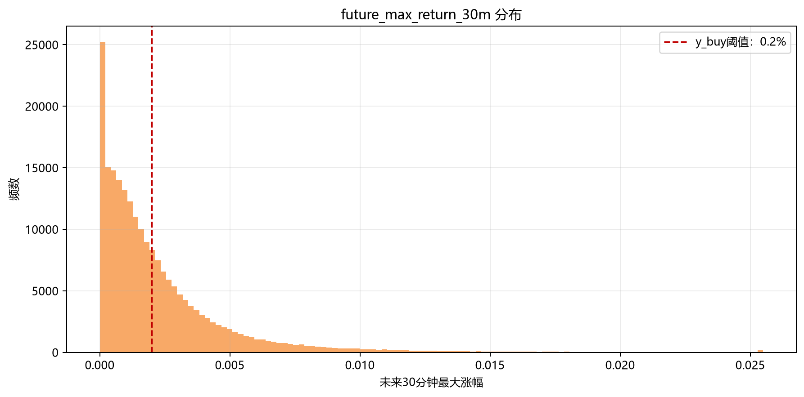

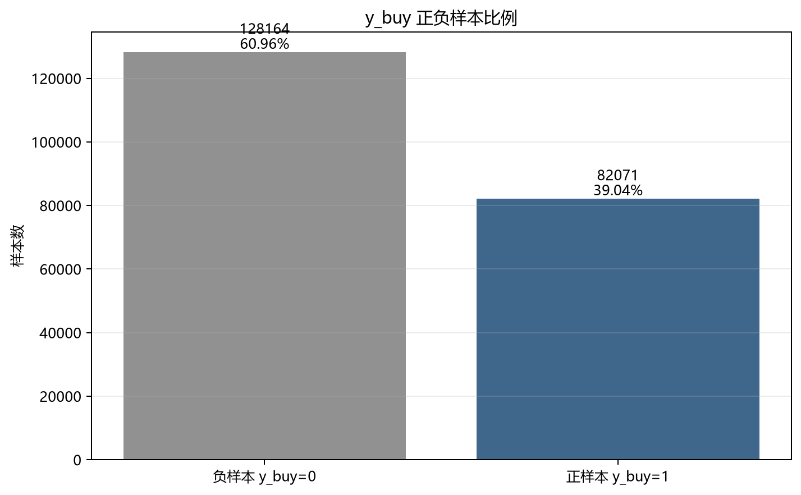

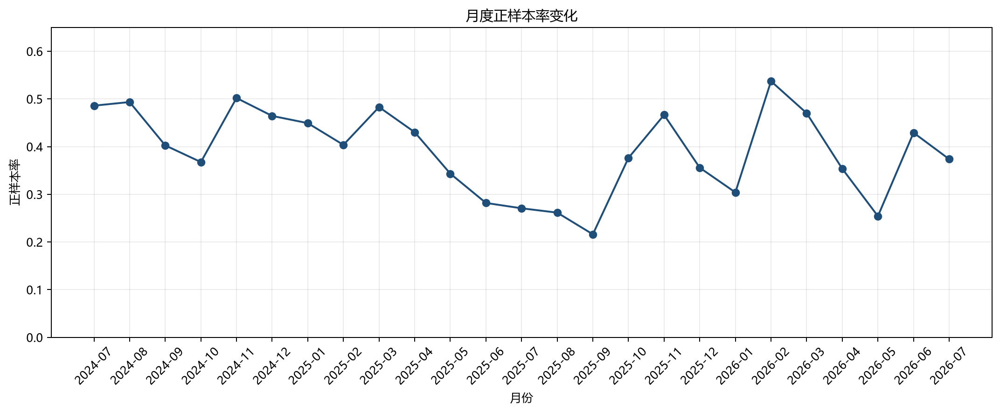

### 2.4 基本数据分析

从价格时间序列看，BTCUSDT 在样本周期内经历了多个阶段的上涨、回撤和震荡，市场状态并不稳定。因此，本项目采用时间顺序切分，而不是随机切分，以保证测试集更接近真实预测场景。

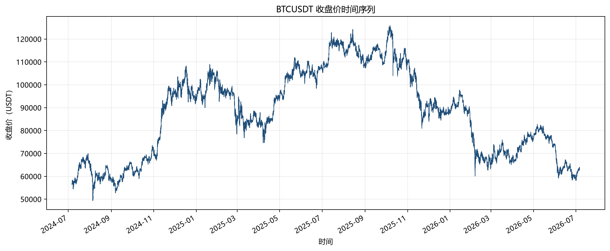

5分钟收益率分布整体集中在0附近，但存在极端负收益观测，数据审计中记录的最小5分钟收益率为 `-0.07338157886293983`。成交量分布呈明显偏态，因此图表采用 `log10(volume)` 方式展示。

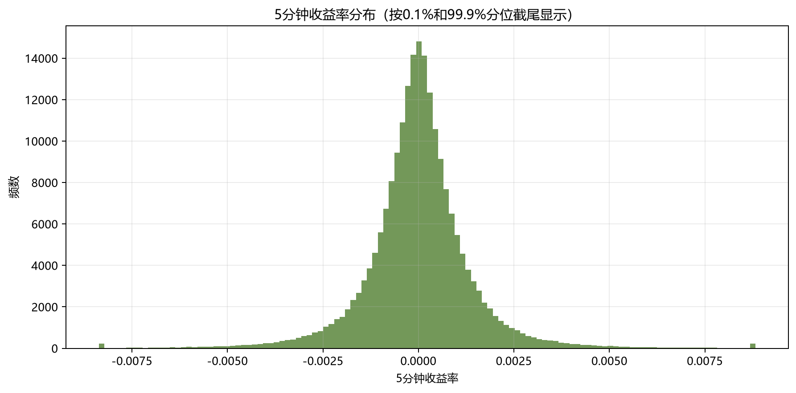

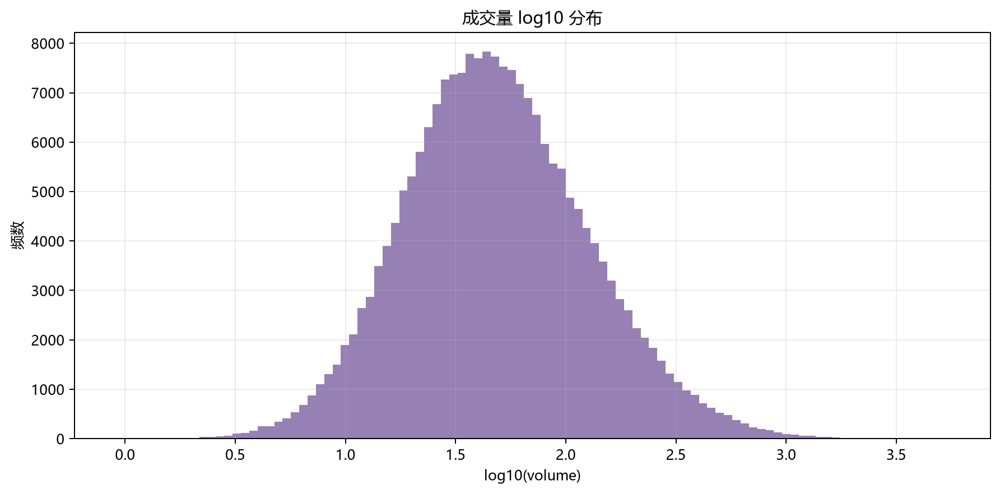

### 2.5 特征工程与相关性分析

项目当前保存的 `feature_columns.json` 共包含20个特征。所有特征均基于当前及历史K线计算，不使用未来K线或目标字段作为模型输入。

**表3 特征工程设计表**

| 特征类别 | 特征字段 | 设计说明 |
|---|---|---|
| 短期收益率 | `return_1`, `return_2`, `return_3`, `return_6`, `return_12`, `return_24`, `return_48` | 使用历史收盘价百分比变化刻画不同窗口的短期涨跌 |
| 均线趋势 | `ma_5`, `ma_10`, `ma_20`, `ma_60` | 使用历史收盘价滚动均值刻画趋势位置 |
| 波动率 | `rolling_std_12`, `rolling_std_24`, `rolling_std_48` | 使用历史1周期收益率滚动标准差刻画波动程度 |
| K线振幅 | `high_low_range` | 使用 `(high - low) / close` 表示当前K线振幅 |
| 成交活跃度 | `volume_zscore_20`, `trade_count_change_1` | 使用成交量20周期标准化值和成交笔数变化率刻画活跃度 |
| K线结构 | `body_ratio`, `upper_shadow_ratio`, `lower_shadow_ratio` | 使用实体、上影线、下影线在K线范围中的比例刻画形态 |

相关性分析使用上述20个特征，并加入 `future_max_return_30m` 和 `y_buy` 进行展示。相关性只能反映线性关系强弱，不能直接代表因果关系。

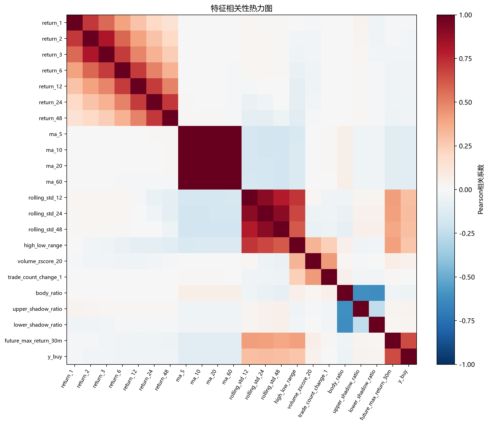

## 3 模型设计

### 3.1 问题建模

本文将 BTCUSDT 短期预测任务拆分为两个子问题：

1. 二分类问题：预测未来30分钟最大上冲是否超过0.2%，目标变量为 `y_buy`。
2. 回归问题：预测未来30分钟最大涨幅数值，目标变量为 `future_max_return_30m`。

分类模型用于刻画“是否值得关注”的概率排序能力，回归模型用于估计上冲空间大小。两者结合后再由信号引擎输出 `BUY`、`WATCH`、`NO_BUY`。

### 3.2 特征工程设计

特征工程模块位于 `src/features/build_features.py`。该模块按时间排序后计算历史收益率、均线、滚动标准差、K线振幅、成交量标准化、成交笔数变化率和K线形态比例，并显式维护禁止作为特征的目标列集合，避免将 `future_max_return_30m`、`y_buy`、`buy_probability`、`predicted_max_return` 等字段泄漏到模型输入中。

### 3.3 对比模型设计

课程模板通常要求多个模型进行对比。当前项目真实产物中已经包含 LightGBM 双模型结果，但未发现 Logistic Regression、Decision Tree、Random Forest、XGBoost 等模型的独立训练和评估产物。因此本文在表4和表5中保留对比模型位置，并标注为“待补充实验”。后续如需完善，可新增独立 baseline 脚本完成对比实验，但不应改动当前主训练流程。

### 3.4 LightGBM 双模型结构

当前模型版本为 `lightgbm_dual_v1`。分类模型使用 `LightGBMClassifier`，回归模型使用 `LightGBMRegressor`。模型配置来自 `config/training.yaml`，其中分类器和回归器均设置 `n_estimators=500`、`learning_rate=0.03`、`num_leaves=31`、`subsample=0.8`、`colsample_bytree=0.8`、`reg_alpha=0.1`、`reg_lambda=0.1`，分类器额外使用 `class_weight="balanced"`。

**图8 LightGBM 双模型结构图**

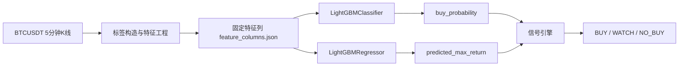

### 3.5 信号生成规则

信号生成模块位于 `src/signals/signal_engine.py`。当前规则如下：

```text
BUY:
  buy_probability >= 0.62 且 predicted_max_return >= 0.0025

WATCH:
  buy_probability >= 0.55 且 predicted_max_return >= 0.0015

NO_BUY:
  不满足 WATCH 条件
```

阈值来自 `config/training.yaml` 与 `runs/latest/models/model_metadata.json`。该信号规则是研究型规则，不代表自动交易策略。

## 4 实验分析与讨论

### 4.1 实验设置

项目使用严格时间顺序切分数据集，配置为训练集70%、验证集15%、测试集15%，并在切分边界处设置 `gap=6`，以降低未来窗口标签带来的边界泄漏风险。

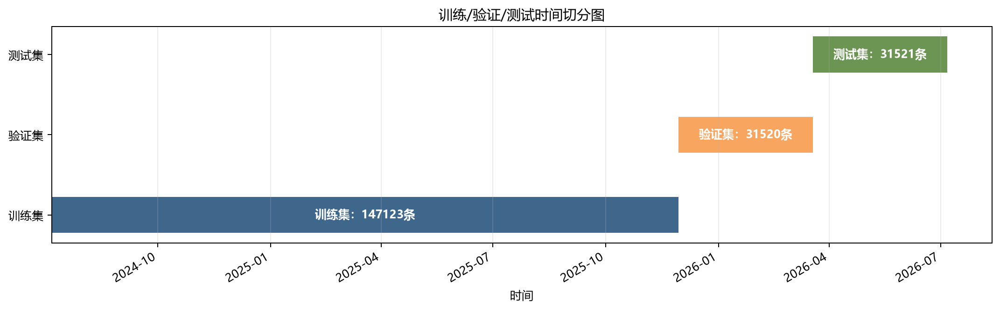

| 数据集 | 样本数 | 起始时间 | 结束时间 |
|---|---:|---|---|
| 训练集 | `147123` | `2024-07-06 11:20:00` | `2025-11-29 07:30:00` |
| 验证集 | `31520` | `2025-11-29 08:05:00` | `2026-03-18 18:40:00` |
| 测试集 | `31521` | `2026-03-18 19:15:00` | `2026-07-06 05:55:00` |

### 4.2 分类模型效果对比

分类模型能力主要评价概率排序和正样本识别能力，包括 AUC、Average Precision、Top 5% hit rate、Top 10% hit rate 等。分类命中率衡量的是未来30分钟最大上冲预测，不等价于交易盈利。

**表4 分类模型效果对比**

| 模型 | AUC | Average Precision | Top 5% hit rate | Top 10% hit rate | 数据来源 |
|---|---:|---:|---:|---:|---|
| Logistic Regression | 待补充实验 | 待补充实验 | 待补充实验 | 待补充实验 | 当前未发现独立实验产物 |
| Decision Tree | 待补充实验 | 待补充实验 | 待补充实验 | 待补充实验 | 当前未发现独立实验产物 |
| Random Forest | 待补充实验 | 待补充实验 | 待补充实验 | 待补充实验 | 当前未发现独立实验产物 |
| XGBoost | 待补充实验 | 待补充实验 | 待补充实验 | 待补充实验 | 当前未发现独立实验产物 |
| LightGBMClassifier | `0.693835` | `0.554033` | `0.719721` | `0.661275` | `training_metrics.json` 测试集 |

**图10 模型效果对比图**

> 当前仅存在 LightGBM 双模型真实产物，其他模型结果待补充实验后再绘制对比图。

### 4.3 回归模型效果对比

回归模型能力衡量的是 `predicted_max_return` 与实际 `future_max_return_30m` 之间的误差，主要指标包括 MAE、RMSE、Pearson correlation、mean absolute error 与误差分位数。当前只有 LightGBMRegressor 的真实测试集产物。

**表5 回归模型效果对比**

| 模型 | MAE / mean absolute error | RMSE | Pearson correlation | 数据来源 |
|---|---:|---:|---:|---|
| Linear Regression | 待补充实验 | 待补充实验 | 待补充实验 | 当前未发现独立实验产物 |
| Decision Tree Regressor | 待补充实验 | 待补充实验 | 待补充实验 | 当前未发现独立实验产物 |
| Random Forest Regressor | 待补充实验 | 待补充实验 | 待补充实验 | 当前未发现独立实验产物 |
| XGBoost Regressor | 待补充实验 | 待补充实验 | 待补充实验 | 当前未发现独立实验产物 |
| LightGBMRegressor | `0.001483` | `0.002295` | `0.373039` | `training_metrics.json` 测试集 |

测试集回归误差分位数如下：

| 指标 | p01 | p05 | p10 | p25 | p50 | p75 | p90 | p95 | p99 |
|---|---:|---:|---:|---:|---:|---:|---:|---:|---:|
| error | `-0.008746` | `-0.003784` | `-0.002185` | `-0.000552` | `0.000542` | `0.001306` | `0.002010` | `0.002506` | `0.003661` |
| absolute error | `0.000023` | `0.000109` | `0.000217` | `0.000545` | `0.001081` | `0.001817` | `0.002937` | `0.004077` | `0.008846` |

### 4.4 信号命中率分析

信号命中率衡量的是 `BUY`、`WATCH`、`NO_BUY` 是否符合结算规则。其中：

- `BUY` 命中：实际未来30分钟最大上冲达到 BUY 信号结算阈值。
- `WATCH` 命中：实际未来30分钟最大上冲达到 WATCH 信号结算阈值。
- `NO_BUY` 正确：实际未来30分钟最大上冲未达到 `y_buy` 阈值。
- `Signal hit rate`：仅对 `SETTLED` 实时预测记录统计，`PENDING` 记录不参与计算。

根据 `runs/latest/reports/live_metrics.json`，当前实时指标如下：

| 指标 | 数值 | 说明 |
|---|---:|---|
| `settled_count` | `20` | 已结算实时记录数 |
| `pending_count` | `1` | 指标文件记录的待结算记录数 |
| `classification_hit_rate` | `0.500000` | 仅基于 SETTLED 记录 |
| `signal_hit_rate` | `0.500000` | 仅基于 SETTLED 记录 |
| `buy_signal_hit_rate` | 待补充更多实时样本 | 当前无可统计的已结算 BUY 记录 |
| `watch_signal_hit_rate` | 待补充更多实时样本 | 当前无可统计的已结算 WATCH 记录 |
| `no_buy_correct_rate` | `0.500000` | 仅基于 SETTLED 的 NO_BUY 记录 |
| `mean_return_error` | `-0.000348` | `predicted_max_return - actual_future_max_return_30m` |
| `mean_abs_return_error` | `0.000959` | 绝对误差均值 |

### 4.5 研究型回测分析

交易型回测衡量的是在指定入场、退出、手续费和滑点假设下的研究结果。当前回测使用测试集预测结果，并在研究假设中考虑双边手续费和滑点，`round_trip_cost` 为 `0.0024`。需要强调，未来30分钟最大上冲命中并不等于持有30分钟后盈利。

**表7 研究型回测结果**

| 指标 | 数值 |
|---|---:|
| BUY 信号数 | `7000` |
| average signals per day | `63.959391` |
| precision_on_triggered_signals | `0.584857` |
| average future max return | `0.003406` |
| average future min return | `-0.003340` |
| average future close return | `0.000101` |
| average return after costs | `-0.002299` |
| total estimated return after costs | `-16.092120` |
| max drawdown | `-1.000000` |
| max consecutive losses | `72` |
| profit factor | `0.255469` |

从表7可见，模型在 BUY 触发样本上具有高于随机基线和规则基线的上冲识别能力，但在当前退出规则和成本假设下，平均扣费后收益为负。因此本文不将该系统描述为盈利交易系统，而将其定位为研究型预测与信号展示系统。

### 4.6 训练集规模对预测效果的影响

当前项目产物中未发现不同训练集规模实验结果。因此本节保留实验计划：后续可在不修改主训练流程的前提下，新增独立实验脚本，分别设置训练集比例为 `0.1` 至 `0.9`，记录 AUC、Average Precision、MAE、RMSE 和训练耗时。

**图11 不同训练集规模下模型效果变化**

> 待实验补充。

### 4.7 运行时间分析

当前 `training_metrics.json` 记录了运行环境版本，但未记录训练耗时、预测耗时或不同模型耗时。因此本节仅报告已记录的软件运行环境，运行时间曲线待实验补充。

**图12 运行时间分析图**

> 待实验补充。

### 4.8 实验结论与不足

综合测试集指标和研究型回测结果，可以得到以下结论：

- LightGBMClassifier 在测试集上具有一定排序能力，AUC 为 `0.693835`，Top 5% hit rate 为 `0.719721`。
- LightGBMRegressor 能够对未来最大涨幅给出数值估计，但 Pearson correlation 为 `0.373039`，说明仍存在较明显误差。
- BUY 信号对未来最大上冲有一定筛选效果，但在当前交易型退出和成本假设下，扣费后平均收益为负。
- 实时准确率样本量较小，当前仅有 `20` 条 SETTLED 记录，不足以支持稳定结论。
- 当前缺少多模型对比、训练集规模实验、运行时间实验和 Dashboard 截图，需要后续补充。

**表6 LightGBM 双模型测试集指标**

| 指标类别 | 指标 | 数值 |
|---|---|---:|
| 分类 | AUC | `0.693835` |
| 分类 | Average Precision | `0.554033` |
| 分类 | Top 5% hit rate | `0.719721` |
| 分类 | Top 10% hit rate | `0.661275` |
| 回归 | MAE | `0.001483` |
| 回归 | RMSE | `0.002295` |
| 回归 | Pearson correlation | `0.373039` |

## 5 系统设计与实现

### 5.1 开发环境

**表10 系统开发环境**

| 类别 | 环境或依赖 | 版本/说明 | 来源 |
|---|---|---|---|
| Python | Python | `3.11.15` | `training_metrics.json` |
| 数据处理 | pandas | `3.0.3` | `training_metrics.json` |
| 数值计算 | numpy | `2.4.6` | `training_metrics.json` |
| 机器学习 | LightGBM | `4.6.0` | `training_metrics.json` |
| 机器学习 | scikit-learn | `1.9.0` | `training_metrics.json` |
| 后端框架 | FastAPI | `>=0.115` | `pyproject.toml` / `requirements.txt` |
| 后端服务 | uvicorn | `>=0.30` | `pyproject.toml` / `requirements.txt` |
| 前端运行时 | Node.js | `v24.14.0` | 本地命令 `node -v` |
| 前端包管理 | npm | `11.9.0` | 本地命令 `npm -v` |
| 前端框架 | React | `^19.1.0` | `frontend/package.json` |
| 前端构建 | Vite | `^7.0.2` | `frontend/package.json` |
| 图表展示 | ECharts | `^5.6.0` | `frontend/package.json` |
| 硬件环境 | CPU / 内存 / GPU | 待补充 | 当前项目产物未记录 |

### 5.2 系统需求分析

系统需求包括：

- 数据层：读取 BTCUSDT 5分钟K线，支持历史训练数据和实时K线数据。
- 训练层：完成数据审计、标签构造、特征工程、时间切分、模型训练和测试集评估。
- 推理层：加载 LightGBM 模型和固定特征列，对最新闭合K线生成预测。
- 信号层：依据 `buy_probability` 与 `predicted_max_return` 输出 `BUY`、`WATCH`、`NO_BUY`。
- 结算层：实时预测记录先写入 `PENDING`，等待未来6根闭合K线后结算为 `SETTLED`。
- API层：向前端提供行情、最新信号、实时记录、实时指标和回测摘要。
- 前端层：展示当前行情、最新信号、最近30条实时预测记录、实时准确率和结算状态。

### 5.3 系统总体架构

**图13 系统总体架构图**

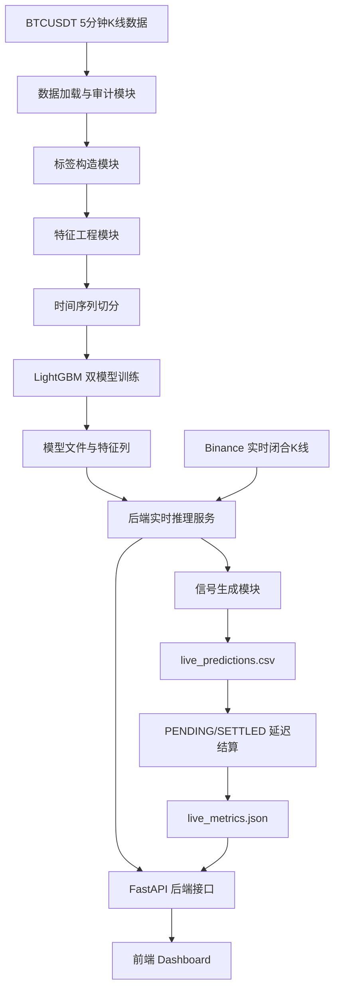

### 5.4 数据存储设计

当前项目采用文件型存储，适合课程展示和研究复现。核心存储结构如下：

**图 数据存储结构图**

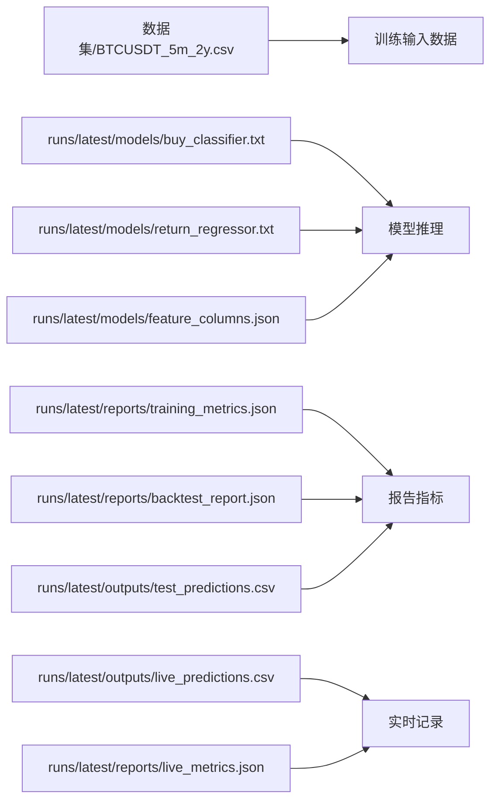

**表8 实时预测记录字段说明**

| 字段名 | 含义 |
|---|---|
| `symbol` | 交易对，如 BTCUSDT |
| `interval` | K线周期，如 5m |
| `open_time` | 当前预测对应的K线开始时间 |
| `close` | 当前K线收盘价 |
| `current_price` | 当前价格，实时记录中与收盘价一致 |
| `buy_probability` | 分类模型输出的未来上冲概率 |
| `predicted_max_return` | 回归模型输出的未来最大涨幅预测 |
| `pred_high_price` | 基于当前价格与预测涨幅计算的预测最高价 |
| `signal` | `BUY`、`WATCH` 或 `NO_BUY` |
| `reason` | 信号生成原因 |
| `settlement_status` | `PENDING` 或 `SETTLED` |
| `settled_at` | 结算时间 |
| `actual_future_max_return_30m` | 实际未来30分钟最大涨幅 |
| `actual_y_buy` | 实际是否达到 `y_buy` 阈值 |
| `predicted_y_buy` | 分类模型按阈值给出的预测类别 |
| `classification_hit` | 分类预测是否命中 |
| `signal_hit` | 信号结算规则是否命中 |
| `return_error` | 回归预测误差 |
| `return_abs_error` | 回归预测绝对误差 |

### 5.5 模型训练模块设计

模型训练主逻辑位于 `src/models/train_classifier.py`，并调用以下模块：

- `src/data/load_data.py`：读取并审计K线数据。
- `src/labels/build_labels.py`：构造未来30分钟标签。
- `src/features/build_features.py`：构造历史特征。
- `src/utils/time_split.py`：完成时间序列切分。
- `src/models/train_regressor.py`：训练 LightGBM 回归器。
- `src/backtest/run_backtest.py`：执行研究型回测和基线比较。
- `src/utils/metrics.py`：计算分类、回归和阈值扫描指标。

**图 模型训练流程图**

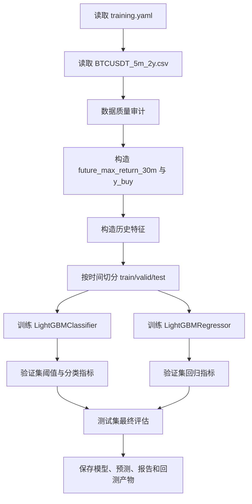

### 5.6 实时预测模块设计

实时预测模块位于 `src/api/realtime_signal.py`。该模块从 Binance 获取最近K线，仅使用已闭合K线构造特征，并加载 `runs/latest/models/buy_classifier.txt`、`return_regressor.txt` 和 `feature_columns.json` 完成预测。

**图14 实时预测流程图**

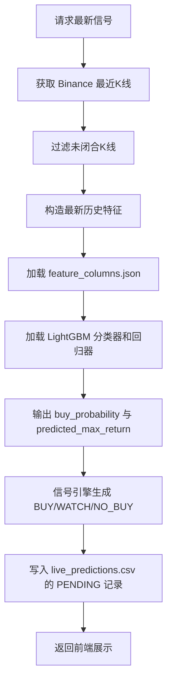

### 5.7 预测结算模块设计

预测结算模块位于 `src/live/settle_live_predictions.py`。实时预测记录先以 `PENDING` 状态保存，等待未来6根5分钟闭合K线可用后，计算实际 `actual_future_max_return_30m`，并写入结算结果。实时准确率只基于 `SETTLED` 记录统计。

**图15 延迟结算机制图**

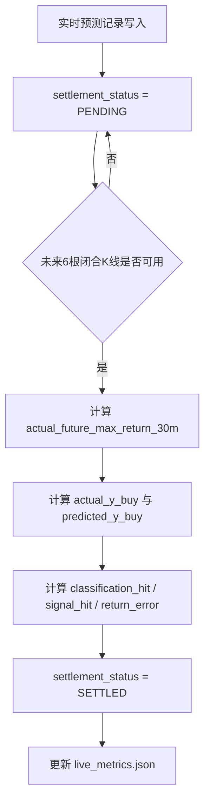

### 5.8 前端看板实现

前端位于 `frontend` 目录，主要页面文件包括：

- `frontend/src/pages/DashboardPage.tsx`：Dashboard 主页面，展示当前行情、最新信号、实时指标和最近30条实时预测记录。
- `frontend/src/services/api.ts`：统一封装 API 请求，通过 `VITE_API_BASE_URL` 调用后端。
- `frontend/src/types/market.ts`：定义前端行情、信号、实时指标和回测数据类型。
- `frontend/src/pages/BacktestPage.tsx`、`ChartPage.tsx`、`SignalsPage.tsx`：回测、图表和信号页面。

**图16 Dashboard 当前行情截图占位**

> 待补充截图。

**图17 Dashboard 最近30条预测记录截图占位**

> 待补充截图。

**图18 Dashboard 实时准确率截图占位**

> 待补充截图。

### 5.9 系统测试

当前项目包含以下测试文件：

- `tests/test_binance_kline_connector.py`
- `tests/test_default_config.py`
- `tests/test_live_api.py`
- `tests/test_live_settlement.py`
- `tests/test_pipeline_units.py`
- `tests/test_predict_contract.py`
- `tests/test_training_pipeline.py`

测试覆盖默认配置、数据管道单元、预测契约、训练流程、实时 API 和实时结算逻辑。最终提交前应运行：

```powershell
.venv\Scripts\python.exe -m pytest
```

**表9 后端 API 接口说明**

| 接口 | 方法 | 功能说明 |
|---|---|---|
| `/api/health` | GET | 后端健康检查 |
| `/api/klines` | GET | 获取 Binance K线数据 |
| `/api/latest-signal` | GET | 生成并返回最新实时预测信号 |
| `/api/signals` | GET | 返回历史测试集信号记录 |
| `/api/live/metrics` | GET | 返回实时预测结算指标 |
| `/api/live/predictions` | GET | 返回最近实时预测记录，默认最近30条 |
| `/api/backtest/summary` | GET | 返回回测摘要 |
| `/api/backtest/equity-curve` | GET | 返回研究型权益曲线 |
| `/api/backtest/signal-distribution` | GET | 返回信号分布 |
| `/api/backtest/precision-threshold` | GET | 返回验证集阈值与 precision 数据 |

## 6 系统部署方案设计

### 6.1 本地部署方案

本地部署适合模型训练、功能开发和课程演示。基本流程如下：

1. 创建并启用 Python 虚拟环境。
2. 安装 `requirements.txt` 中的后端依赖。
3. 运行或加载已有模型产物。若只进行演示，可直接使用 `runs/latest/models` 下已有 LightGBM 模型文件。
4. 启动 FastAPI 后端服务，提供行情、信号、实时记录和指标接口。
5. 进入 `frontend` 目录安装前端依赖，并启动 Vite 开发服务。
6. 前端通过 `VITE_API_BASE_URL` 指向后端 API 地址。

### 6.2 Docker 部署方案

Docker 部署可将前端和后端拆分为两个容器：

- 前端容器：构建 `frontend` 目录中的 Vite 应用，并通过静态服务器提供页面访问。
- 后端容器：运行 FastAPI 服务，挂载模型文件目录 `runs/latest/models`。
- 数据卷：挂载 `runs/latest/outputs/live_predictions.csv` 和 `runs/latest/reports/live_metrics.json` 所在目录，避免容器重启后实时记录丢失。
- 后续升级：若需要稳定生产化部署，应将 CSV 文件升级为 Supabase/PostgreSQL 等持久化数据库。

### 6.3 GitHub + Vercel 云端部署方案

本项目课程展示阶段可采用 GitHub + Vercel 的方式完成前端在线部署。首先，将项目源码上传至 GitHub 仓库，GitHub 作为代码托管与版本管理平台。随后，在 Vercel 平台中导入 GitHub 仓库，并将前端 Dashboard 作为独立 Web 应用进行构建。

由于本项目前端采用 Vite 构建，若前端项目位于 `frontend` 目录，Vercel 配置建议如下：

| 配置项 | 配置值 |
|---|---|
| Root Directory | `frontend` |
| Install Command | `npm install` |
| Build Command | `npm run build` |
| Output Directory | `dist` |
| API 环境变量 | `VITE_API_BASE_URL=<后端API地址>` |

Vercel 与 GitHub 集成后，每次 GitHub push 可以自动触发前端构建和部署，从而提升课程展示阶段的迭代效率。需要注意的是，Vercel 在本项目中主要负责前端静态页面托管和访问，不应被描述为完整模型训练平台。LightGBM 模型训练不在 Vercel 上进行，模型推理、Binance K线获取、PENDING/SETTLED 结算和 `live_predictions` 持久化均应由独立后端服务负责。

本项目课程展示阶段可采用 Vercel 部署前端 Dashboard，后端模型推理服务在本地或独立云服务器运行；若需完整生产化上线，应将实时预测记录从 CSV 文件升级为 Supabase/PostgreSQL 等持久化数据库，并将模型推理服务部署在支持长期运行的后端环境中。

**图19 GitHub + Vercel 部署架构图**

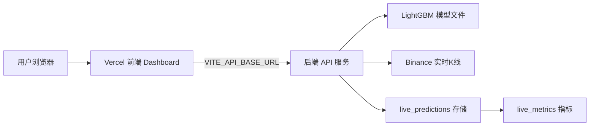

## 7 总结

本文基于 BTCUSDT 5分钟K线构建了一个短期最高涨幅预测与实时信号看板系统。系统以未来30分钟最大上冲作为研究目标，采用 LightGBM 分类器和回归器分别输出冲高概率与最大涨幅预测，并结合阈值规则生成三类信号。项目实现了从数据审计、标签构造、特征工程、模型训练、测试集评估、研究型回测到实时预测结算和前端展示的完整流程。

实验结果表明，模型在未来最大上冲识别上具有一定排序能力，但当前研究型回测在考虑交易成本后仍为负收益，说明预测命中不等于真实交易盈利。系统当前更适合作为课程实践、模型研究和信号可视化系统，而不是实际自动交易系统。

## 8 心得体会

通过本项目实践，可以体会到大数据技术实践不仅包括模型训练，还包括数据质量审计、标签定义、时间序列切分、特征防泄漏、模型评估、系统接口设计和部署边界划分等完整工程问题。尤其在金融时间序列任务中，随机切分、未来数据泄漏和夸大模型效果都会导致不可靠结论。因此，本文在实验分析中严格区分分类能力、回归误差、信号命中率和交易型回测结果，并明确说明研究型预测结果不等于真实交易收益。

此外，实时预测系统需要处理延迟结算问题。预测产生时未来6根K线尚未发生，因此只能先写入 `PENDING`，待未来数据完整后再结算为 `SETTLED`。这一机制使实时准确率统计更加严谨，也体现了从离线模型到在线系统时需要考虑的数据时效性问题。

## 9 小组分工

由于当前项目文件中未记录小组成员姓名、学号和实际贡献值，本文不编造个人信息，先保留待补充占位。

**表11 小组分工与贡献值**

| 成员姓名 | 学号 | 主要分工 | 贡献值 |
|---|---|---|---:|
| 待补充 | 待补充 | 数据审计、标签构造、特征工程 | 待补充 |
| 待补充 | 待补充 | 模型训练、实验分析、回测评估 | 待补充 |
| 待补充 | 待补充 | 后端 API、实时预测与结算 | 待补充 |
| 待补充 | 待补充 | 前端 Dashboard、部署说明、报告整理 | 待补充 |
