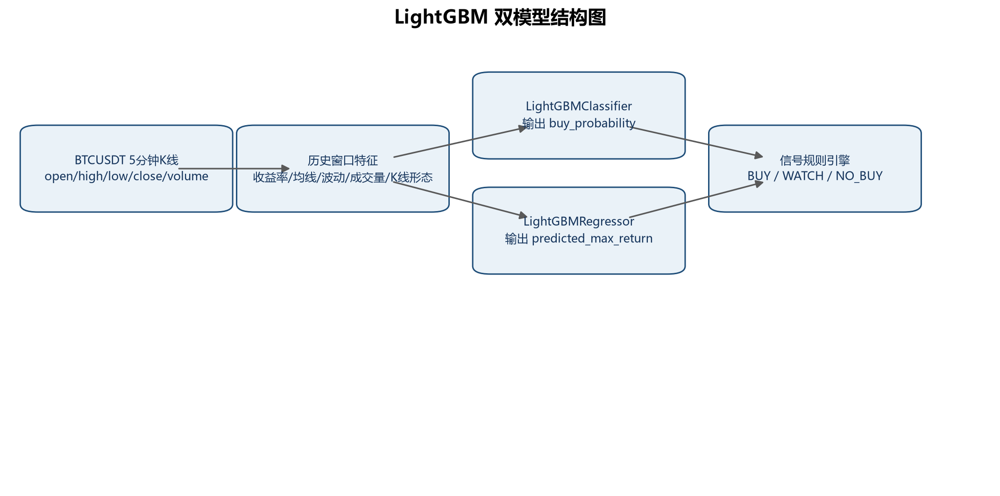
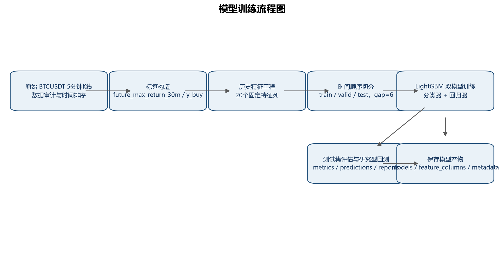
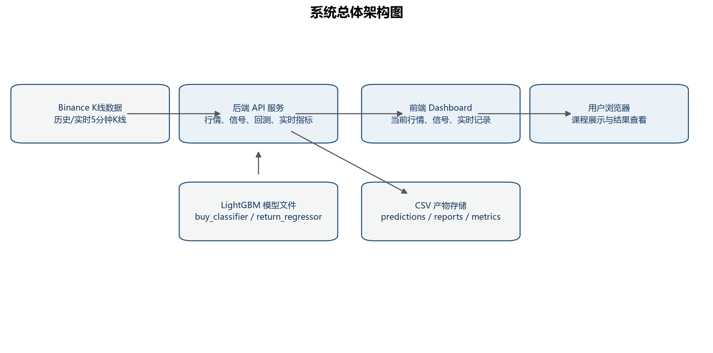
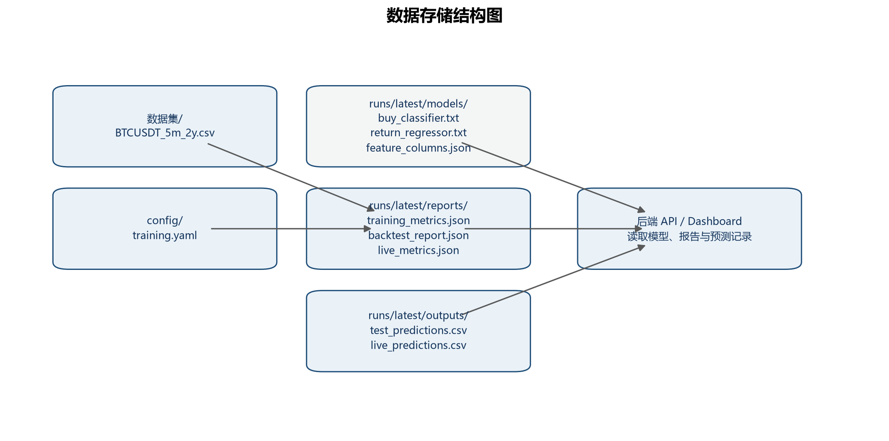
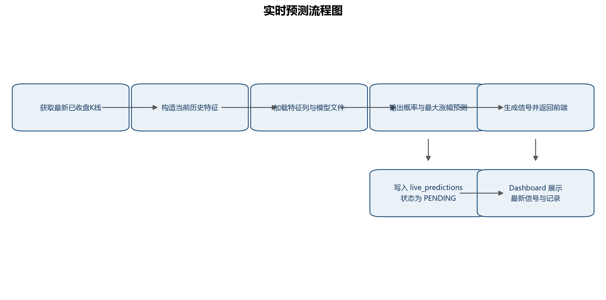
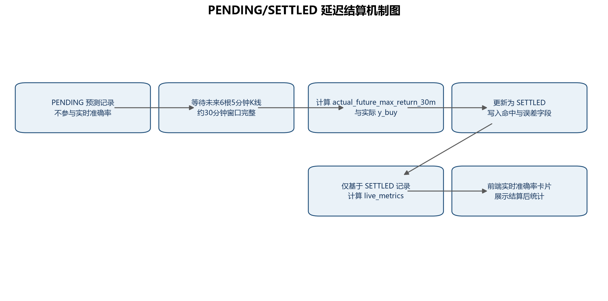
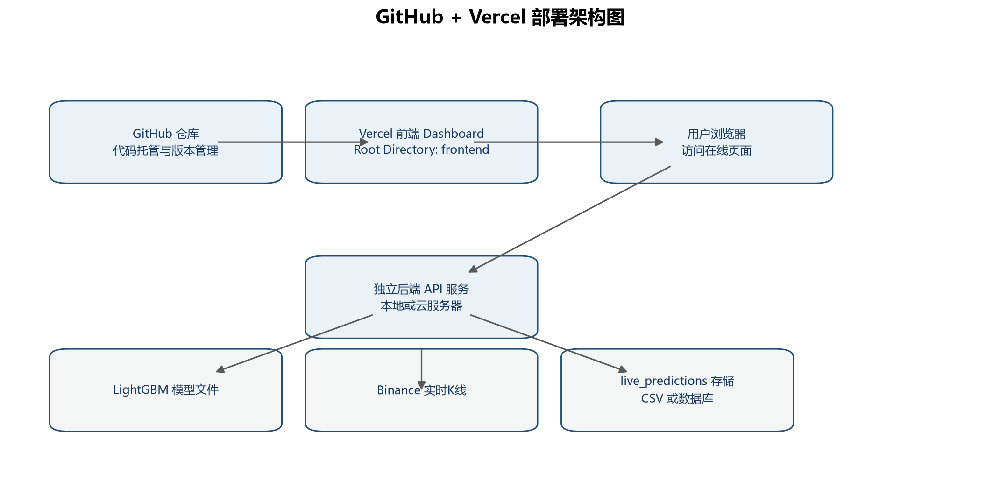

# 《基于 BTCUSDT 5分钟K线的短期最高涨幅预测与实时信号看板系统设计》

课程名称：大数据技术实践
完成形式：个人完成
学生姓名：张橙
学号：20231113107
报告日期：2026年7月8日

## 目录

摘要
1 项目背景
2 数据探索
3 模型设计
4 实验分析与结果讨论
5 系统设计与实现
6 系统部署方案设计
7 总结
8 心得体会
9 小组分工

## 摘要

数字货币市场具有连续交易、波动频繁和短周期行情变化明显等特点，适合作为大数据技术实践中时间序列数据处理、特征工程、机器学习建模和实时系统展示的综合案例。本文基于 BTCUSDT 5分钟K线数据，构建一个研究型短期预测系统，目标不是直接进行自动交易，而是预测未来30分钟内最高价相对当前K线收盘价的最大上冲幅度，并通过前端 Dashboard 展示模型信号、实时预测记录和延迟结算结果。

本项目使用约两年的 BTCUSDT 5分钟K线数据，原始数据共 210,241 条记录。标签定义为 future_max_return_30m，即未来6根5分钟K线最高价相对当前收盘价的最大涨幅；当该值大于 0.002 时，分类标签 y_buy 取 1。项目在数据审计、标签构造、历史特征工程和时间顺序切分基础上，采用 LightGBMClassifier 输出 buy_probability，并采用 LightGBMRegressor 输出 predicted_max_return，再由信号规则生成 BUY、WATCH 和 NO_BUY。系统实现了后端 API、实时预测记录、PENDING/SETTLED 延迟结算、live_metrics 实时统计和前端 Dashboard 展示。

实验结果表明，在测试集上，分类模型 AUC 为 0.693835，Average Precision 为 0.554033，Top 5% hit rate 为 0.719721，Top 10% hit rate 为 0.661275；回归模型 MAE 为 0.001483，RMSE 为 0.002295，Pearson correlation 为 0.373039。研究型回测中，模型 BUY 信号数为 7,000，precision_on_triggered_signals 为 0.584857，但扣除手续费与滑点后的平均收益为 -0.002299，说明当前模型虽然能在一定程度上识别短期上冲样本，但不能直接作为真实交易策略使用。实时记录方面，当前 live_metrics.json 中 SETTLED 记录为 29 条，PENDING 记录为 1 条，signal_hit_rate 为 0.448276。实时样本量仍较小，该指标主要说明系统闭环可以运行，不能代表长期稳定效果。

关键词：BTCUSDT；5分钟K线；LightGBM；短期最高涨幅预测；实时信号看板；延迟结算

## 1 项目背景

### 1.1 研究背景

金融时间序列数据具有高频、噪声强、非平稳和受外部因素影响明显等特点。与传统日线行情相比，5分钟K线能够更细粒度地反映短周期价格变化、成交量变化和局部波动结构。BTCUSDT 作为交易活跃的数字货币交易对，具有数据连续性强、样本规模较大和行情波动充分等特征，因此适合用于大数据技术实践中的数据处理、特征构造、模型训练、评估分析与系统展示。

本项目关注的不是“未来30分钟后的收盘价是多少”，而是“未来30分钟内是否出现过相对当前收盘价足够明显的最高价上冲”。这种建模方式更接近短周期机会识别问题，也更适合使用未来窗口内最高价构造监督学习标签。但需要强调的是，未来最高价上冲被预测命中，并不等价于真实交易盈利，因为真实交易还受到入场价格、成交滑点、手续费、退出规则和风险控制等因素影响。

### 1.2 项目目的

本项目的目的不是接入真实交易，也不是证明模型可以直接产生交易收益，而是基于 BTCUSDT 5分钟K线构建一个研究型短期最高涨幅预测系统，用于研究未来30分钟内是否存在上冲机会，并通过前端看板展示模型预测、实时记录和预测结算结果。

具体目标包括：完成 BTCUSDT 5分钟K线数据处理与质量审计；构造 future_max_return_30m 和 y_buy 标签；基于历史K线生成不含未来信息的特征；训练 LightGBM 分类模型和回归模型；生成 BUY、WATCH 和 NO_BUY 研究信号；在测试集上进行分类、回归和研究型回测评估；实现实时预测记录写入、PENDING/SETTLED 延迟结算和实时指标统计；构建 Dashboard 展示当前行情、最新信号、最近实时预测记录和实时准确率。

### 1.3 研究内容

本文围绕“数据、模型、系统、部署”四个层面展开。数据层面完成原始K线字段分析、缺失值检查、时间连续性检查、价格合理性检查和标签分布分析。模型层面采用双模型结构，分类模型用于估计未来上冲事件发生概率，回归模型用于估计未来最大上冲幅度。系统层面实现从实时K线获取、特征生成、模型推理、信号生成、记录持久化到延迟结算的闭环。部署层面设计本地部署、Docker 部署和 GitHub + Vercel 前端部署方案，并明确 Vercel 只用于前端 Dashboard 部署，不承担模型训练和长期运行的实时预测后端。

### 1.4 本文主要工作

本文主要工作包括：第一，基于项目真实数据文件和训练产物完成数据探索与指标整理；第二，说明 future_max_return_30m 和 y_buy 的构造方式，并解释未来30分钟窗口的含义；第三，介绍 LightGBM 双模型结构及 BUY、WATCH、NO_BUY 信号规则；第四，基于 training_metrics.json、backtest_report.json、live_metrics.json 和 CSV 输出文件整理测试集指标、回测结果和实时结算指标；第五，结合项目真实文件路径说明标签、特征、模型、信号、后端 API、实时结算、前端 Dashboard 和测试模块；第六，给出课程展示阶段可执行的 GitHub + Vercel 前端部署方案。

## 2 数据探索

### 2.1 数据来源与字段说明

本项目使用 BTCUSDT 5分钟K线数据，数据路径由 config/training.yaml 指定为 数据集/BTCUSDT_5m_2y.csv。training_metrics.json 记录的原始数据规模为 210,241 行，时间范围为 2024-07-06 06:25:00 至 2026-07-06 06:25:00。

表1 原始K线数据字段说明

| 字段名 | 含义 | 数据类型记录 |
|---|---|---|
| open_time | K线开盘时间 | datetime64[us] |
| open | 当前5分钟K线开盘价 | float64 |
| high | 当前5分钟K线最高价 | float64 |
| low | 当前5分钟K线最低价 | float64 |
| close | 当前5分钟K线收盘价 | float64 |
| volume | 成交量 | float64 |
| close_time | K线收盘时间戳 | int64 |
| quote_volume | 计价资产成交额 | float64 |
| trade_count | 成交笔数 | int64 |

### 2.2 数据质量审计

数据质量审计结果来自 runs/latest/reports/training_metrics.json。审计内容覆盖行数、字段、缺失值、重复时间、5分钟间隔连续性、价格关系合理性和极端收益率检查。

表2 数据质量审计结果

| 审计项目 | 结果 |
|---|---:|
| 原始记录数 | 210,241 |
| 字段数 | 9 |
| 时间起点 | 2024-07-06 06:25:00 |
| 时间终点 | 2026-07-06 06:25:00 |
| 缺失值记录 | 0 |
| duplicate_open_time | 0 |
| non_5m_intervals | 0 |
| estimated_missing_bars | 0 |
| high < low | 0 |
| high < open | 0 |
| high < close | 0 |
| low > open | 0 |
| low > close | 0 |
| 5分钟收益率最小值 | -0.07338157886293983 |
| 5分钟收益率最大值 | 0.04081567095864935 |
| 审计结论 | passed = true |

审计结果显示，当前数据不存在缺失值、重复 open_time、非5分钟间隔和价格关系异常。审计报告中记录了极端负收益率观测值，说明短周期数据存在剧烈波动，需要在建模和评估中采用稳健、保守的解释方式。

### 2.3 标签定义与标签分布

本项目的预测窗口为未来6根5分钟K线，即未来30分钟。由于当前K线的 high 已经在当前时刻可知，标签只使用 high[t+1] 至 high[t+6]，不包含 high[t]，从而避免把当前已发生价格信息混入未来标签。最后6行样本由于无法获得完整未来窗口，因此在标签构造后被丢弃。

公式（1）未来30分钟最大上冲幅度定义如下：

future_max_return_30m_t = max(high_{t+1}, high_{t+2}, high_{t+3}, high_{t+4}, high_{t+5}, high_{t+6}) / close_t - 1    （1）

公式（2）二分类标签定义如下：

y_buy_t = I(future_max_return_30m_t > 0.002)    （2）

其中 0.002 表示 0.2% 的研究阈值。该阈值用于定义未来30分钟内是否出现足够幅度的最高价上冲，不等于真实交易盈利阈值。future_max_return_30m 和 y_buy 只作为标签或评估字段使用，不进入模型输入特征。

根据 training_metrics.json，标签构造后的 labeled_rows 为 210,235，positive_count 为 82,071，positive_rate 为 0.3903774347753704，负样本数量为 128,164。

图1 BTCUSDT 收盘价时间序列

图2 5分钟收益率分布（0.1%～99.9%分位数截尾展示）

说明：图2 为 0.1%～99.9% 分位数截尾展示，极端值未删除，只是为了改善可视化效果。

图3 成交量 log10 分布

图4 future_max_return_30m 分布

图5 y_buy 正负样本比例

### 2.4 基本数据分析

从收盘价时间序列可以看出，BTCUSDT 在两年样本区间内存在明显的阶段性趋势和波动切换。5分钟收益率分布集中在零附近，但存在较长尾部，反映短周期价格变化具有尖峰厚尾特征。成交量分布经过 log10 转换后仍表现出明显偏态，说明市场活跃程度在不同时间段差异较大。

月度正样本率反映 y_buy 在不同市场阶段的变化。training_metrics.json 中月度正样本率最低出现在 2025-09，为 0.21608796296296295；较高月份包括 2026-02，正样本率为 0.5372023809523809。该现象说明标签分布并非时间稳定，模型评估必须使用时间顺序切分，而不能随机打乱样本。

图6 月度正样本率变化

### 2.5 特征工程与相关性分析

特征工程由 src/features/build_features.py 实现，所有特征均基于当前及历史K线计算，不使用未来标签字段。runs/latest/models/feature_columns.json 中记录了当前模型实际使用的 20 个特征。

表3 特征工程设计表

| 特征类别 | 特征列 | 说明 |
|---|---|---|
| 价格收益率特征 | return_1、return_2、return_3、return_6、return_12、return_24、return_48 | 描述不同历史窗口的收盘价变化 |
| 均线趋势特征 | ma_5、ma_10、ma_20、ma_60 | 描述短中期价格趋势 |
| 波动特征 | rolling_std_12、rolling_std_24、rolling_std_48、high_low_range | 描述短周期收益波动和K线振幅 |
| 成交活跃度特征 | volume_zscore_20、trade_count_change_1 | 描述成交量异常程度和成交笔数变化 |
| K线形态特征 | body_ratio、upper_shadow_ratio、lower_shadow_ratio | 描述实体和上下影线结构 |

图7 特征相关性热力图

相关性热力图用于观察特征之间及特征与标签分析字段之间的线性相关程度。需要说明的是，Pearson 相关性只表示线性关系，不代表因果关系；future_max_return_30m 和 y_buy 仅用于标签分析和评估解释，不进入模型输入；ma_5、ma_10、ma_20、ma_60 等均线特征之间高度相关，说明均线特征存在一定冗余；Pearson 相关性不能替代 LightGBM feature importance，最终特征贡献仍需结合树模型的特征重要性和验证集、测试集表现综合判断。

## 3 模型设计

### 3.1 问题建模

本项目将短期最高涨幅预测拆分为两个监督学习问题。

1. 二分类问题：判断未来30分钟内最大上冲幅度是否超过 0.2%，目标变量为 y_buy，模型输出 buy_probability。
2. 回归问题：估计 future_max_return_30m 的连续值，目标变量为未来30分钟最大涨幅，模型输出 predicted_max_return。

这种建模方式将“是否存在上冲机会”和“上冲幅度可能有多大”分开处理，有助于信号规则同时考虑概率置信度和空间大小。需要说明的是，分类命中率衡量的是未来30分钟最大上冲事件预测是否命中，回归误差衡量的是 predicted_max_return 与 actual future max return 的偏差，二者都不等同于实际交易收益。

### 3.2 特征工程设计

特征工程遵循严格的时间因果约束，即第 t 根K线的特征只能由第 t 根及其之前的历史K线计算。src/features/build_features.py 中显式维护 FORBIDDEN_FEATURE_COLUMNS，禁止 future_max_return_30m、future_min_return_30m、future_close_return_30m、y_buy、signal、buy_probability 和 predicted_max_return 等目标或预测字段进入输入特征。

特征构造后，缺少完整历史窗口的早期样本会被删除。training_metrics.json 记录 rows_after_feature_dropna 为 210,176，feature_count 为 20。

### 3.3 LightGBM 算法原理

LightGBM 属于梯度提升决策树 GBDT 系列算法。GBDT 的基本思想是通过多轮弱学习器逐步拟合前一轮模型的残差或负梯度，使多个决策树以加法模型形式共同完成预测。对于结构化表格数据，GBDT 类模型通常能够较好处理非线性关系、特征交互和不同量纲特征。

LightGBM 在 GBDT 基础上采用直方图算法、叶子优先生长等机制，能够提升训练效率并降低内存消耗。当前项目数据规模为 20 万级K线样本，特征为结构化历史统计特征，因此 LightGBM 比 LSTM、Transformer 等深度模型更适合作为第一版工程落地模型。深度学习模型可以作为后续研究方向，但不应在没有稳定基线和充分对比实验前替代当前主模型。

### 3.4 双模型结构设计

单一分类模型能够给出未来上冲事件的概率，但不能直接估计未来最大涨幅空间；单一回归模型能够给出涨幅预测值，但缺少事件发生置信度表达。因此，本项目采用 LightGBMClassifier 与 LightGBMRegressor 的双模型结构。

分类模型以 y_buy 为目标，输出 buy_probability；回归模型以 future_max_return_30m 为目标，输出 predicted_max_return。最终信号由两个输出共同决定，从而避免仅凭概率或仅凭幅度作出信号判断。

图8 LightGBM 双模型结构图

### 3.5 信号生成规则

信号生成规则由 src/signals/signal_engine.py 实现，阈值来自 config/training.yaml 和 model_metadata.json。当前项目规则如下：

公式（3）当 buy_probability >= 0.62 且 predicted_max_return >= 0.0025 时，signal = BUY。

公式（4）当 buy_probability >= 0.55 且 predicted_max_return >= 0.0015，且不满足 BUY 条件时，signal = WATCH。

公式（5）其他情况下，signal = NO_BUY。

BUY 命中率表示未来30分钟最大上冲预测命中率，不等于交易盈利率。预测未来30分钟最大上冲成功，也不等于持有30分钟后盈利。真实交易结果还取决于入场、退出、手续费、滑点和风险控制规则。

### 3.6 模型训练与推理流程

训练流程使用时间顺序切分，train、valid、test 分别占 70%、15%、15%，并通过 gap=6 降低相邻切分边界的标签窗口泄漏风险。训练阶段保存模型文件、特征列、模型元数据、测试集预测和训练报告。推理阶段读取 feature_columns.json 保证特征顺序一致，加载 buy_classifier.txt 与 return_regressor.txt，输出预测概率和预测最大涨幅，再交由信号规则生成研究信号。

图9 训练/验证/测试时间切分图

说明：图9 中训练集、验证集和测试集严格按时间顺序切分，且配置 gap=6。由于标签窗口为未来6根5分钟K线，gap=6 用于降低切分边界附近未来窗口重叠带来的泄漏风险。

图10 模型训练流程图

## 4 实验分析与结果讨论

### 4.1 实验设置

实验配置来自 config/training.yaml 与 training_metrics.json。随机种子为 42，标签窗口 horizon 为 6，upside_threshold 为 0.002。训练集、验证集和测试集按时间顺序切分，不进行随机打乱。训练集共 147,123 行，时间范围为 2024-07-06 11:20:00 至 2025-11-29 07:30:00；验证集共 31,520 行，时间范围为 2025-11-29 08:05:00 至 2026-03-18 18:40:00；测试集共 31,521 行，时间范围为 2026-03-18 19:15:00 至 2026-07-06 05:55:00。

分类模型参数包括 objective=binary、n_estimators=500、learning_rate=0.03、num_leaves=31、subsample=0.8、colsample_bytree=0.8、reg_alpha=0.1、reg_lambda=0.1、class_weight=balanced。回归模型参数包括 objective=regression、n_estimators=500、learning_rate=0.03、num_leaves=31、subsample=0.8、colsample_bytree=0.8、reg_alpha=0.1 和 reg_lambda=0.1。

### 4.2 分类模型预测效果

分类模型能力主要通过 AUC、Average Precision、Top 5% hit rate 和 Top 10% hit rate 衡量。其中 AUC 衡量整体排序能力，Average Precision 更关注正样本稀疏场景下的精确率-召回率表现，Top hit rate 衡量模型概率最高的一部分样本中实际正样本占比。

表4 分类模型测试集效果

| 模型 | AUC | Average Precision | Top 5% hit rate | Top 10% hit rate | 数据来源 |
|---|---:|---:|---:|---:|---|
| LightGBMClassifier | 0.693835 | 0.554033 | 0.719721 | 0.661275 | training_metrics.json |

在测试集上，模型最高概率样本中的命中率高于测试集整体正样本比例，说明分类模型具有一定排序能力。但 AUC 未达到很高水平，表明模型对短周期噪声数据的区分能力仍有限，不能据此夸大模型效果。

### 4.3 回归模型预测效果

回归模型用于估计 future_max_return_30m 的连续值。其效果通过 MAE、RMSE、Pearson correlation、误差分位数和绝对误差分位数进行评估。MAE 衡量平均绝对误差，RMSE 对较大误差更敏感，Pearson correlation 衡量预测值与真实值的线性相关程度。

表5 回归模型测试集效果

| 模型 | MAE | RMSE | Pearson correlation | p50 绝对误差 | p95 绝对误差 | p99 绝对误差 | 数据来源 |
|---|---:|---:|---:|---:|---:|---:|---|
| LightGBMRegressor | 0.001483 | 0.002295 | 0.373039 | 0.001081 | 0.004077 | 0.008846 | training_metrics.json |

测试集误差分位数显示，回归模型中位数绝对误差约为 0.1081%，但高分位误差明显增大，反映出短周期极端波动样本仍较难预测。因此，predicted_max_return 可作为研究参考，不应被解释为确定收益。

### 4.4 信号命中率分析

信号命中率衡量 BUY、WATCH 和 NO_BUY 是否符合结算规则。根据 src/live/settle_live_predictions.py，BUY 信号命中要求 actual_future_max_return_30m >= 0.0025；WATCH 信号命中要求 actual_future_max_return_30m >= 0.0015；NO_BUY 正确要求 actual_future_max_return_30m < 0.002。该规则仍然评价的是未来30分钟最大上冲是否符合条件，不等同于交易盈利。

测试集 test_predictions.csv 中共有 31,521 条记录，其中 BUY 为 7,000 条，WATCH 为 4,504 条，NO_BUY 为 20,017 条。在 probability threshold 0.62 的测试集阈值指标中，signal_count 为 7,308，precision 为 0.581007，recall 为 0.378533，F1 为 0.458408。研究型回测报告中，实际采用双阈值信号规则后的 BUY 信号数为 7,000，precision_on_triggered_signals 为 0.584857。

表6 LightGBM 双模型测试集综合指标

| 指标类别 | 指标 | 数值 | 含义 |
|---|---|---:|---|
| 分类 | AUC | 0.693835 | 测试集整体排序能力 |
| 分类 | Average Precision | 0.554033 | PR 曲线综合表现 |
| 分类 | Top 5% hit rate | 0.719721 | 概率最高5%样本的正样本率 |
| 分类 | Top 10% hit rate | 0.661275 | 概率最高10%样本的正样本率 |
| 回归 | MAE | 0.001483 | 最大涨幅预测平均绝对误差 |
| 回归 | RMSE | 0.002295 | 最大涨幅预测均方根误差 |
| 回归 | Pearson correlation | 0.373039 | 预测值与真实最大涨幅相关性 |

### 4.5 研究型回测结果

研究型回测由 src/backtest/run_backtest.py 实现。回测只对 BUY 行进行评估，入场价格采用 next-open 研究收益字段，即 future_close_return_30m_from_next_open、future_max_return_30m_from_next_open 和 future_min_return_30m_from_next_open；退出价格假设为 t+6 的 close。手续费参数 fee_rate_per_side 为 0.001，滑点参数 slippage_rate_per_side 为 0.0002。

公式（6）round_trip_cost = 2 × (fee_rate_per_side + slippage_rate_per_side) = 2 × (0.001 + 0.0002) = 0.0024。

当前回测将重叠 BUY 信号按独立研究样本统计，用于评估信号在历史样本上的性质。这种设定并不等同于真实资金账户的逐笔交易撮合，也没有加入仓位管理、止损止盈和资金占用约束。

表7 研究型回测结果

| 策略 | BUY 信号数 | average signals per day | precision_on_triggered_signals | average future max return | average future min return | average future close return | average return after costs | max drawdown | max consecutive losses | profit factor |
|---|---:|---:|---:|---:|---:|---:|---:|---:|---:|---:|
| LightGBM 双模型信号 | 7,000 | 63.959391 | 0.584857 | 0.003406 | -0.003340 | 0.000101 | -0.002299 | -1.000000 | 72 | 0.255469 |
| 随机信号基线 | 7,000 | 63.959391 | 0.357571 | 0.002068 | -0.002080 | -0.000007 | -0.002407 | -1.000000 | 134 | 0.118551 |
| 规则信号基线 | 5,265 | 48.106599 | 0.359544 | 0.002202 | -0.002139 | -0.000114 | -0.002514 | -0.999998 | 137 | 0.129626 |

回测结果显示，LightGBM 双模型信号的 precision_on_triggered_signals 高于随机信号和规则信号基线，说明模型在识别未来上冲样本方面具有一定研究价值。但 average return after costs 为 -0.002299，profit factor 为 0.255469，说明在当前 next-open 入场、t+6 close 退出、手续费和滑点假设下，该信号不能直接作为真实交易策略。测试窗口内 buy_and_hold_reference 的收益为 -0.116515，仅作为区间行情参考。

### 4.6 实时预测结算结果

实时预测记录存储在 runs/latest/outputs/live_predictions.csv，实时指标存储在 runs/latest/reports/live_metrics.json。实时准确率只基于 SETTLED 的 live prediction records 统计，PENDING 记录不能参与实时准确率计算。当前 live_predictions.csv 共 30 条记录，其中 SETTLED 为 29 条，PENDING 为 1 条；信号分布为 NO_BUY 21 条、BUY 8 条、WATCH 1 条。

当前 live_metrics.json 记录 settled_count 为 29，pending_count 为 1，classification_hit_rate 为 0.448276，signal_hit_rate 为 0.448276，buy_signal_hit_rate 为 0.142857，watch_signal_hit_rate 为 1.000000，no_buy_correct_rate 为 0.523810，mean_abs_return_error 为 0.001373。由于 SETTLED 样本量仍然较小，这些实时指标主要用于说明系统实时预测、延迟结算和指标统计链路可以运行，不能作为长期稳定性的结论。

### 4.7 实验结论与不足

综合测试集和实时记录结果，本项目已完成从历史K线数据处理、标签构造、特征工程、LightGBM 双模型训练、测试集评估、研究型回测、实时预测记录、PENDING/SETTLED 延迟结算到 Dashboard 展示的数据闭环。测试集分类指标说明模型具有一定排序能力，回归指标说明模型能够给出一定相关性的最大涨幅估计，回测指标说明模型信号相较随机和规则基线具有更高的上冲命中率。

同时，当前实验仍存在限制。第一，本报告没有新增 Logistic Regression、Decision Tree、Random Forest、XGBoost 等模型训练实验，因此多模型对比只能报告已完成的 LightGBM 双模型和回测基线结果，模型效果对比图不应在缺少真实实验数据时绘制。第二，尚未形成不同训练集规模下模型效果变化的独立实验，因此训练集规模图应作为后续改进内容。第三，尚未形成完整运行时间基准实验，本文仅记录了 training_metrics.json 中的运行环境版本，运行时间图也应在补充真实耗时数据后再绘制。第四，实时 SETTLED 样本量只有 29 条，不足以说明长期稳定效果。第五，Dashboard 当前行情、最新信号、最近30条实时预测、实时准确率卡片、回测页面、GitHub 仓库页面和 Vercel 部署成功页面需在系统运行及在线部署后由作者手动加入报告。第六，当前 live_predictions 采用 CSV 文件存储，适合课程展示和小规模验证；若进行生产化部署，应升级为 Supabase/PostgreSQL 等数据库，并加入更完整的权限、监控和容错机制。

## 5 系统设计与实现

### 5.1 开发环境

表10 系统开发环境

| 类别 | 工具或库 | 版本或说明 | 来源 |
|---|---|---|---|
| 后端语言 | Python | 3.11.15 | training_metrics.json |
| 数据处理 | pandas | 3.0.3 | training_metrics.json |
| 数值计算 | numpy | 2.4.6 | training_metrics.json |
| 机器学习 | LightGBM | 4.6.0 | training_metrics.json |
| 机器学习评估 | scikit-learn | 1.9.0 | training_metrics.json |
| 后端框架 | FastAPI | 项目 requirements.txt | requirements.txt |
| 前端框架 | React | ^19.1.0 | frontend/package.json |
| 构建工具 | Vite | ^7.0.2 | frontend/package.json |
| 前端语言 | TypeScript | ^5.8.3 | frontend/package.json |
| 图表库 | ECharts | ^5.6.0 | frontend/package.json |

### 5.2 系统需求分析

系统功能需求包括历史数据处理、标签构造、特征工程、模型训练、模型推理、信号生成、研究型回测、实时预测记录、延迟结算、实时指标统计、后端 API 和前端 Dashboard 展示。非功能需求包括时间序列切分不打乱、特征不使用未来信息、模型指标可复现、预测记录可追踪、实时准确率只统计 SETTLED 记录，以及部署方案中明确前后端职责边界。

### 5.3 系统总体架构

系统由数据层、模型层、服务层和展示层组成。数据层包括历史K线 CSV、测试集预测输出、实时预测记录和训练报告；模型层包括 LightGBM 分类器、LightGBM 回归器和 feature_columns.json；服务层包括 FastAPI 后端、Binance K线获取、实时推理和结算；展示层包括 React Dashboard。

图11 系统总体架构图

### 5.4 数据存储设计

项目当前采用文件型存储。原始K线数据位于 数据集/BTCUSDT_5m_2y.csv，模型文件位于 runs/latest/models，训练报告和指标位于 runs/latest/reports，测试集预测和实时预测记录位于 runs/latest/outputs。该设计便于课程展示和复现实验，但在高并发、多用户和长期运行场景下需要升级为数据库存储。

图12 数据存储结构图

表8 实时预测记录字段说明

| 字段 | 含义 |
|---|---|
| symbol | 交易对，当前为 BTCUSDT |
| interval | K线周期，当前为 5m |
| open_time | 被预测K线的开盘时间 |
| close / current_price | 当前K线收盘价或当前展示价格 |
| buy_probability | 分类模型输出的买入概率 |
| predicted_max_return | 回归模型输出的未来最大涨幅预测 |
| pred_high_price | 根据当前价格和预测涨幅换算的预测高点 |
| signal | BUY、WATCH 或 NO_BUY |
| reason | 信号生成原因 |
| settlement_status | PENDING 或 SETTLED |
| settled_at | 结算时间 |
| actual_future_max_return_30m | 实际未来30分钟最大涨幅 |
| actual_y_buy | 实际是否满足 y_buy |
| predicted_y_buy | 概率阈值下的预测分类结果 |
| classification_hit | 分类是否命中 |
| signal_hit | 信号是否符合结算规则 |
| return_error / return_abs_error | 回归预测误差及绝对误差 |

### 5.5 标签构造模块

标签构造模块位于 src/labels/build_labels.py。add_future_labels 函数根据 horizon=6 构造 future_max_return_30m、future_min_return_30m、future_close_return_30m，以及基于 next-open 的回测字段。该模块会丢弃最后6行缺少完整未来窗口的样本，并根据 upside_threshold=0.002 构造 y_buy。

### 5.6 特征工程模块

特征工程模块位于 src/features/build_features.py。该模块生成收益率、均线、滚动波动、K线振幅、成交量 z-score、成交笔数变化和K线形态特征。模块中维护了 FORBIDDEN_FEATURE_COLUMNS，用于防止目标字段、未来收益字段和预测输出字段进入模型输入。

### 5.7 模型训练模块

模型训练相关文件包括 src/models/train_classifier.py、src/models/train_regressor.py 和 src/models/predict.py。训练产物包括 runs/latest/models/buy_classifier.txt、runs/latest/models/return_regressor.txt、runs/latest/models/feature_columns.json 和 runs/latest/models/model_metadata.json。当前任务未修改训练主逻辑，只基于现有产物生成报告材料。

### 5.8 实时预测模块

实时预测入口位于 src/api/realtime_signal.py。该模块负责获取最新 BTCUSDT 5分钟K线，转换为模型特征输入，加载模型和特征列，调用预测函数，并生成最新信号。实时预测流程如图13所示。

图13 实时预测流程图

图14 Dashboard 当前行情模块截图（需作者运行系统后手动补充）

图15 Dashboard 最新信号模块截图（需作者运行系统后手动补充）

图16 Dashboard 最近30条预测记录截图（需作者运行系统后手动补充）

图17 Dashboard 实时准确率截图（需作者运行系统后手动补充）

### 5.9 预测结算模块

预测结算模块位于 src/live/settle_live_predictions.py。实时预测刚生成时写入 live_predictions.csv，并标记为 PENDING。系统在未来6根5分钟K线完整后计算 actual_future_max_return_30m，更新 actual_y_buy、classification_hit、signal_hit、return_error 等字段，并将记录改为 SETTLED。实时准确率只从 SETTLED 记录计算，PENDING 记录不参与指标统计。

图18 PENDING/SETTLED 延迟结算机制图

### 5.10 后端 API 模块

后端 API 位于 src/api/app.py，采用 FastAPI 实现。API 主要为前端提供行情、最新信号、历史信号、实时指标、实时预测记录和回测结果。

表9 后端 API 接口说明

| 接口 | 方法 | 功能说明 |
|---|---|---|
| /api/health | GET | 健康检查 |
| /api/klines | GET | 获取 Binance K线并转换为前端可用结构 |
| /api/latest-signal | GET | 构造最新模型预测信号 |
| /api/signals | GET | 读取历史信号记录 |
| /api/live/metrics | GET | 读取并结算实时指标 |
| /api/live/predictions | GET | 获取最近实时预测记录 |
| /api/backtest/summary | GET | 获取回测摘要 |
| /api/backtest/equity-curve | GET | 获取回测权益曲线 |
| /api/backtest/signal-distribution | GET | 获取回测信号分布 |
| /api/backtest/precision-threshold | GET | 获取阈值精度分析 |

### 5.11 前端 Dashboard 模块

前端位于 frontend 目录，主要页面包括 frontend/src/pages/DashboardPage.tsx、SignalsPage.tsx、ChartPage.tsx 和 BacktestPage.tsx。前端通过 frontend/src/services/api.ts 调用后端接口，展示当前行情、最新信号、实时预测记录、实时准确率、历史信号和回测结果。Dashboard 只展示研究信号和模型评估结果，不接入真实交易下单。

图19 回测页面截图（需作者运行系统后手动补充）

### 5.12 系统测试

项目测试文件位于 tests 目录，覆盖默认配置、Binance K线连接器、实时 API、实时结算、训练流水线、预测契约和基础流水线单元测试。代表性文件包括 tests/test_default_config.py、tests/test_live_api.py、tests/test_live_settlement.py、tests/test_pipeline_units.py、tests/test_predict_contract.py 和 tests/test_training_pipeline.py。测试模块用于保证核心函数输入输出、实时结算规则和模型预测契约符合预期。

## 6 系统部署方案设计

### 6.1 本地部署方案

本地部署适合课程开发和展示。基本流程为：创建 Python 虚拟环境并安装 requirements.txt 中依赖；确认 config/training.yaml 中数据路径和产物路径正确；使用已有模型文件或按课程要求运行训练流程；启动 FastAPI 后端服务；进入 frontend 目录安装前端依赖并启动开发服务；浏览器访问前端页面，通过 VITE_API_BASE_URL 指向本地后端 API。

本地部署的优点是调试方便，能够直接读取 runs/latest 下的模型、报告和实时预测记录。其不足是访问范围受本机环境限制，不适合作为长期在线系统。

### 6.2 Docker 部署方案

Docker 部署可将前端和后端分别容器化。后端容器负责模型加载、Binance K线获取、实时预测、PENDING/SETTLED 结算和 API 输出；前端容器负责构建和托管 Dashboard 静态页面。模型文件和实时预测 CSV 应通过数据卷挂载，避免容器重建导致产物丢失。后续如接入数据库，可将 live_predictions 和 live_metrics 从 CSV 文件迁移至 PostgreSQL 或 Supabase。

Docker 部署方案需要重点处理模型文件路径、数据卷权限、后端长期运行、定时结算任务和跨域配置。对于课程展示，Docker 可作为本地可复现部署方式；对于生产化系统，需要进一步加入日志、监控、重启策略和数据库备份。

### 6.3 GitHub + Vercel 前端部署方案

本项目课程展示阶段可采用 GitHub + Vercel 的方式部署前端 Dashboard。首先，将项目源码上传至 GitHub 仓库，由 GitHub 作为代码托管和版本管理平台。随后，在 Vercel 平台导入 GitHub 仓库，并将前端 Dashboard 作为独立 Web 应用部署。

由于本项目前端位于 frontend 目录，并采用 Vite 构建，Vercel 配置建议如下：Root Directory 设置为 frontend，Install Command 设置为 npm install，Build Command 设置为 npm run build，Output Directory 设置为 dist。前端通过环境变量 VITE_API_BASE_URL 调用后端 API，用于获取当前行情、最新信号、最近30条实时预测记录、实时准确率和回测结果。Vercel 与 GitHub 集成后，每次 GitHub push 可以自动触发构建与部署，从而提高课程展示阶段的迭代效率。

需要明确的是，Vercel 主要负责前端静态页面托管和访问，不是完整模型训练平台。LightGBM 模型训练不在 Vercel 上进行；实时预测后端、Binance K线获取、PENDING/SETTLED 结算和 live_predictions 持久化也不应夸大为全部部署在 Vercel 前端环境中。课程展示阶段可以采用“前端部署在 Vercel，后端运行在本地或独立云服务器，数据存储使用 CSV 文件”的方案。

本项目课程展示阶段可采用 Vercel 部署前端 Dashboard，后端模型推理服务在本地或独立云服务器运行；若需完整生产化上线，应将实时预测记录从 CSV 文件升级为 Supabase/PostgreSQL 等持久化数据库，并将模型推理服务部署在支持长期运行的后端环境中。

图20 GitHub + Vercel 部署架构图

图21 GitHub 仓库页面截图（需作者运行系统后手动补充）

图22 Vercel 部署成功页面截图（需作者运行系统后手动补充）

### 6.4 生产化部署改进方向

若后续从课程展示升级为生产化研究平台，应将后端部署至 Render、Railway、Fly.io 或云服务器等支持长期运行的环境，并将 CSV 存储升级为 Supabase/PostgreSQL。实时预测和结算任务应使用定时任务或队列系统管理，同时增加日志监控、异常告警、接口鉴权、请求限流、模型版本管理和数据备份机制。前端仍可继续使用 Vercel 托管，但前端只负责展示与交互，不负责模型训练、实时推理和持久化存储。

## 7 总结

本文基于 BTCUSDT 5分钟K线数据完成了短期最高涨幅预测与实时信号看板系统设计。项目目的在于构建研究型预测系统，分析未来30分钟内是否存在最大上冲机会，并通过 Dashboard 展示模型结果，而不是接入真实交易。

在数据层面，项目完成了 210,241 条原始K线记录的数据审计和 210,235 条标签样本构造。在模型层面，项目采用 LightGBMClassifier 与 LightGBMRegressor 的双模型结构，分别输出 buy_probability 和 predicted_max_return。在实验层面，测试集 AUC 为 0.693835，Average Precision 为 0.554033，回归 MAE 为 0.001483，RMSE 为 0.002295。研究型回测显示，BUY 信号的上冲命中能力高于基线，但扣费后收益为负，因此当前模型不能直接用于真实交易。在系统层面，项目实现了实时预测记录、PENDING/SETTLED 延迟结算、live_metrics 实时指标和前端展示。

总体来看，本项目完成了大数据技术实践所需的数据处理、机器学习建模、结果评估、系统实现和部署方案设计闭环。后续工作应重点补充多模型对比、训练集规模实验、运行时间基准、更多实时 SETTLED 样本和生产化数据库部署。

## 8 心得体会

通过本项目实践，我对时间序列机器学习任务中的数据泄漏风险、标签设计、时间顺序切分和模型评估有了更直观的理解。短周期K线数据看似样本量较大，但噪声强、分布变化快，模型指标必须谨慎解释。特别是未来30分钟最大上冲预测与真实交易盈利之间存在明显差异，不能将分类命中率简单等同于交易胜率。

在系统实现方面，本项目使我认识到课程项目不仅需要训练模型，还需要形成可复现的数据产物、清晰的 API 契约、可追踪的实时预测记录和可解释的前端展示。PENDING/SETTLED 延迟结算机制能够把预测和未来真实结果对应起来，是连接离线评估与实时展示的重要环节。部署方案设计也说明，前端上线与完整后端生产化是两个不同问题，必须明确 Vercel、后端服务和持久化存储各自的职责。

## 9 小组分工

表11 小组分工与贡献值

| 姓名 | 学号 | 分工 | 贡献值 |
|---|---|---|---:|
| 张橙 | 20231113107 | 数据处理、标签构造、特征工程、模型训练、回测评估、后端 API、实时预测结算、前端 Dashboard、部署方案、报告撰写 | 100% |
